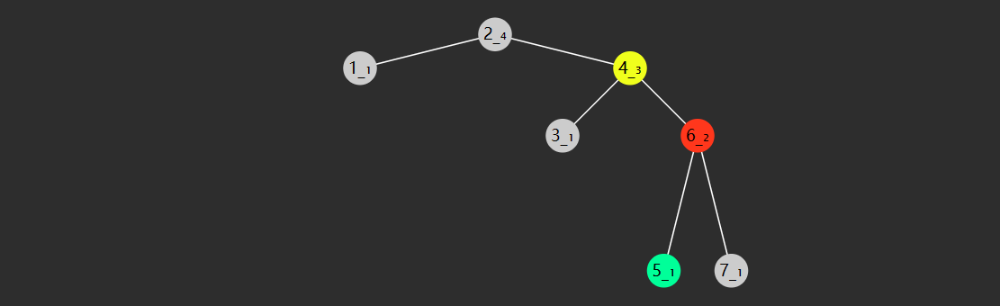

# 一. 基础算法

## 查找算法

不管是之前学过的数组、链表、队列、还是栈，这些线性结构中，如果想在其中查找一个元素，效率是比较慢的，只有$O(N)$，因此如果你的需求是实现快速查找，那么就需要新的算法设计，也需要新的数据结构支持。

还记得最先介绍的那个二分查找算法吗？它的查找效率能够达到 $O(\log{N})$，是不是还不错？不过呢，它需要对数组事先排好序，而排序的成本是比较高的。那么有没有一个折中的办法呢？有，那就是接下来要给大家介绍的**二叉搜索树**

### 1. 二叉搜索树

二叉搜索树（也称二叉排序树）是符合下面特征的二叉树：

1. 树节点增加 key 属性，用来比较谁大谁小，key 不可以重复
2. 对于任意一个树节点，它的 key 比左子树的 key 都大，同时也比右子树的 key 都小，例如下图所示


轻易看出要查找 7 （从根开始）自然就可应用二分查找算法，只需三次比较

* 与 4 比，较之大，向右找
* 与 6 比，较之大，继续向右找
* 与 7 比，找到

查找的时间复杂度与**树高**相关，插入、删除也是如此。

* 如果这棵树长得还不赖（左右平衡）上图，那么时间复杂度均是 $O(\log{N})$
* 当然，这棵树如果长得丑（左右高度相差过大）下图，那么这时是最糟的情况，时间复杂度是 $O(N)$


> 注：
>
> * 二叉搜索树 - 英文 binary search tree，简称 BST
> * 二叉排序树 - 英文 binary ordered tree 或 binary sorted tree

#### 定义节点

```java
static class BSTNode {
    int key; // 若希望任意类型作为 key, 则后续可以将其设计为 Comparable 接口
    Object value;
    BSTNode left;
    BSTNode right;

    public BSTNode(int key) {
        this.key = key;
        this.value = key;
    }

    public BSTNode(int key, Object value) {
        this.key = key;
        this.value = value;
    }

    public BSTNode(int key, Object value, BSTNode left, BSTNode right) {
        this.key = key;
        this.value = value;
        this.left = left;
        this.right = right;
    }
}
```


#### 查询

**递归实现**

```java
public Object get(int key) {
    return doGet(root, key);
}

private Object doGet(BSTNode node, int key) {
    if (node == null) {
        return null; // 没找到
    }
    if (key < node.key) {
        return doGet(node.left, key); // 向左找
    } else if (node.key < key) {
        return doGet(node.right, key); // 向右找
    } else {
        return node.value; // 找到了
    }
}
```


**非递归实现**

```java
public Object get(int key) {
    BSTNode node = root;
    while (node != null) {
        if (key < node.key) {
            node = node.left;
        } else if (node.key < key) {
            node = node.right;
        } else {
            return node.value;
        }
    }
    return null;
}
```


#### Comparable

如果希望让除 int 外更多的类型能够作为 key，一种方式是 key 必须实现 Comparable 接口。

```java
public class BSTTree2<T extends Comparable<T>> {
    static class BSTNode<T> {
        T key; // 若希望任意类型作为 key, 则后续可以将其设计为 Comparable 接口
        Object value;
        BSTNode<T> left;
        BSTNode<T> right;

        public BSTNode(T key) {
            this.key = key;
            this.value = key;
        }

        public BSTNode(T key, Object value) {
            this.key = key;
            this.value = value;
        }

        public BSTNode(T key, Object value, BSTNode<T> left, BSTNode<T> right) {
            this.key = key;
            this.value = value;
            this.left = left;
            this.right = right;
        }
    }

    BSTNode<T> root;

    public Object get(T key) {
        return doGet(root, key);
    }

    private Object doGet(BSTNode<T> node, T key) {
        if (node == null) {
            return null;
        }
        int result = node.key.compareTo(key);
        if (result > 0) {
            return doGet(node.left, key);
        } else if (result < 0) {
            return doGet(node.right, key);
        } else {
            return node.value;
        }
    }

}
```

还有一种做法不要求 key 实现 Comparable 接口，而是在构造 Tree 时把比较规则作为 Comparator 传入，将来比较 key 大小时都调用此 Comparator 进行比较，这种做法可以参考 Java 中的 java.util.TreeMap


#### 最小

**递归实现**

```java
public Object min() {
    return doMin(root);
}

public Object doMin(BSTNode node) {
    if (node == null) {
        return null;
    }
    // 左边已走到头
    if (node.left == null) { 
        return node.value;
    }
    return doMin(node.left);
}
```


**非递归实现**

```java
public Object min() {
    if (root == null) {
        return null;
    }
    BSTNode p = root;
    // 左边未走到头
    while (p.left != null) {
        p = p.left;
    }
    return p.value;
}
```


#### 最大

**递归实现**

```java
public Object max() {
    return doMax(root);
}

public Object doMax(BSTNode node) {
    if (node == null) {
        return null;
    }
    // 右边已走到头
    if (node.left == null) { 
        return node.value;
    }
    return doMin(node.right);
}
```

**非递归实现**

```java
public Object max() {
    if (root == null) {
        return null;
    }
    BSTNode p = root;
    // 右边未走到头
    while (p.right != null) {
        p = p.right;
    }
    return p.value;
}
```


#### 新增

**递归实现**

```java
public void put(int key, Object value) {
    root = doPut(root, key, value);
}

private BSTNode doPut(BSTNode node, int key, Object value) {
    if (node == null) {
        return new BSTNode(key, value);
    }
    if (key < node.key) {
        node.left = doPut(node.left, key, value);
    } else if (node.key < key) {
        node.right = doPut(node.right, key, value);
    } else {
        node.value = value;
    }
    return node;
}
```

* 若找到 key，走 else 更新找到节点的值
* 若没找到 key，走第一个 if，创建并返回新节点
  * 返回的新节点，作为上次递归时 node 的左孩子或右孩子
  * 缺点是，会有很多不必要的赋值操作


**非递归实现**

```java
public void put(int key, Object value) {
    BSTNode node = root;
    BSTNode parent = null;
    while (node != null) {
        parent = node;
        if (key < node.key) {
            node = node.left;
        } else if (node.key < key) {
            node = node.right;
        } else {
            // 1. key 存在则更新
            node.value = value;
            return;
        }
    }
    // 2. key 不存在则新增
    if (parent == null) {
        root = new BSTNode(key, value);
    } else if (key < parent.key) {
        parent.left = new BSTNode(key, value);
    } else {
        parent.right = new BSTNode(key, value);
    }
}
```


#### 前驱后继


一个节点的前驱（前任）节点是指比它小的节点中，最大的那个

一个节点的后继（后任）节点是指比它大的节点中，最小的那个

例如上图中

* 1 没有前驱，后继是 2
* 2 前驱是 1，后继是 3
* 3 前驱是 2，后继是 4
* ...

简单的办法是中序遍历，即可获得排序结果，此时很容易找到前驱后继

要效率更高，需要研究一下规律，**找前驱**分成 2 种情况：


1. 节点有左子树，此时前驱节点就是左子树的最大值，图中属于这种情况的有
   * 2 的前驱是1
   * 4 的前驱是 3
   * 6 的前驱是 5
   * 7 的前驱是 6
2. 节点没有左子树，若离它最近的祖先自从左而来，此祖先即为前驱，如
   * 3 的祖先 2 自左而来，前驱 2
   * 5 的祖先 4 自左而来，前驱 4
   * 8 的祖先 7 自左而来，前驱 7
   * 1 没有这样的祖先，前驱 null


**找后继**也分成 2 种情况


1. 节点有右子树，此时后继节点即为右子树的最小值，如
   * 2 的后继 3
   * 3 的后继 4
   * 5 的后继 6
   * 7 的后继 8
2. 节点没有右子树，若离它最近的祖先自从右而来，此祖先即为后继，如
   * 1 的祖先 2 自右而来，后继 2
   * 4 的祖先 5 自右而来，后继 5
   * 6 的祖先 7 自右而来，后继 7
   * 8 没有这样的祖先，后继 null


```java
public Object predecessor(int key) {
    BSTNode ancestorFromLeft = null;
    BSTNode p = root;
    while (p != null) {
        if (key < p.key) {
            p = p.left;
        } else if (p.key < key) {
            ancestorFromLeft = p;
            p = p.right;
        } else {
            break;
        }
    }

    if (p == null) {
        return null;
    }
    // 情况1 - 有左孩子
    if (p.left != null) {
        return max(p.left);
    }
    // 情况2 - 有祖先自左而来
    return ancestorFromLeft != null ? ancestorFromLeft.value : null;
}


public Object successor(int key) {
    BSTNode ancestorFromRight = null;
    BSTNode p = root;
    while (p != null) {
        if (key < p.key) {
            ancestorFromRight = p;
            p = p.left;
        } else if (p.key < key) {
            p = p.right;
        } else {
            break;
        }
    }

    if (p == null) {
        return null;
    }
    // 情况1 - 有右孩子
    if (p.right != null) {
        return min(p.right);
    }
    // 情况2 - 有祖先自右而来
    return ancestorFromRight != null ? ancestorFromRight.value : null;
}
```


#### 删除

要删除某节点（称为 D），必须先找到被删除节点的父节点，这里称为 Parent

1. 删除节点没有左孩子，将右孩子托孤给 Parent
2. 删除节点没有右孩子，将左孩子托孤给 Parent
3. 删除节点左右孩子都没有，已经被涵盖在情况1、情况2 当中，把 null 托孤给 Parent
4. 删除节点左右孩子都有，可以将它的后继节点（称为 S）托孤给 Parent，设 S 的父亲为 SP，又分两种情况
   1. SP 就是被删除节点，此时 D 与 S 紧邻，只需将 S 托孤给 Parent
   2. SP 不是被删除节点，此时 D 与 S 不相邻，此时需要将 S 的后代托孤给 SP，再将 S 托孤给 Parent

**非递归实现**

```java
/**
 * <h3>根据关键字删除</h3>
 *
 * @param key 关键字
 * @return 被删除关键字对应值
 */
public Object delete(int key) {
    BSTNode p = root;
    BSTNode parent = null;
    while (p != null) {
        if (key < p.key) {
            parent = p;
            p = p.left;
        } else if (p.key < key) {
            parent = p;
            p = p.right;
        } else {
            break;
        }
    }
    if (p == null) {
        return null;
    }
    // 删除操作
    if (p.left == null) {
        shift(parent, p, p.right); // 情况1
    } else if (p.right == null) {
        shift(parent, p, p.left); // 情况2
    } else {
        // 情况4
        // 4.1 被删除节点找后继
        BSTNode s = p.right;
        BSTNode sParent = p; // 后继父亲
        while (s.left != null) {
            sParent = s;
            s = s.left;
        }
        // 4.2 删除和后继不相邻, 处理后继的后事
        if (sParent != p) {                
            shift(sParent, s, s.right); // 不可能有左孩子
            s.right = p.right;
        }
        // 4.3 后继取代被删除节点
        shift(parent, p, s);
        s.left = p.left;
    }
    return p.value;
}

/**
 * 托孤方法
 *
 * @param parent  被删除节点的父亲
 * @param deleted 被删除节点
 * @param child   被顶上去的节点
 */
// 只考虑让 n1父亲的左或右孩子指向 n2, n1自己的左或右孩子并未在方法内改变
private void shift(BSTNode parent, BSTNode deleted, BSTNode child) {
    if (parent == null) {
        root = child;
    } else if (deleted == parent.left) {
        parent.left = child;
    } else {
        parent.right = child;
    }
}
```


**递归实现**

```java
public Object delete(int key) {
    ArrayList<Object> result = new ArrayList<>();
    root = doDelete(root, key, result);
    return result.isEmpty() ? null : result.get(0);
}

public BSTNode doDelete(BSTNode node, int key, ArrayList<Object> result) {
    if (node == null) {
        return null;
    }
    if (key < node.key) {
        node.left = doDelete(node.left, key, result);
        return node;
    }
    if (node.key < key) {
        node.right = doDelete(node.right, key, result);
        return node;
    }
    result.add(node.value);
    if (node.left != null && node.right != null) {
        BSTNode s = node.right;
        while (s.left != null) {
            s = s.left;
        }
        s.right = doDelete(node.right, s.key, new ArrayList<>());
        s.left = node.left;
        return s;
    }
    return node.left != null ? node.left : node.right;
}
```

说明

1. `ArrayList<Object> result` 用来保存被删除节点的值
3. 第二、第三个 if 对应没找到的情况，继续递归查找和删除，注意后续的 doDelete 返回值代表删剩下的，因此需要更新
4. 最后一个 return 对应删除节点只有一个孩子的情况，返回那个不为空的孩子，待删节点自己因没有返回而被删除
5. 第四个 if 对应删除节点有两个孩子的情况，此时需要找到后继节点，并在待删除节点的右子树中删掉后继节点，最后用后继节点替代掉待删除节点返回，别忘了改变后继节点的左右指针


#### 找小的

```java
public List<Object> less(int key) {
    ArrayList<Object> result = new ArrayList<>();
    BSTNode p = root;
    LinkedList<BSTNode> stack = new LinkedList<>();
    while (p != null || !stack.isEmpty()) {
        if (p != null) {
            stack.push(p);
            p = p.left;
        } else {
            BSTNode pop = stack.pop();
            if (pop.key < key) {
                result.add(pop.value);
            } else {
                break;
            }
            p = pop.right;
        }
    }
    return result;
}
```


#### 找大的

```java
public List<Object> greater(int key) {
    ArrayList<Object> result = new ArrayList<>();
    BSTNode p = root;
    LinkedList<BSTNode> stack = new LinkedList<>();
    while (p != null || !stack.isEmpty()) {
        if (p != null) {
            stack.push(p);
            p = p.left;
        } else {
            BSTNode pop = stack.pop();
            if (pop.key > key) {
                result.add(pop.value);
            }
            p = pop.right;
        }
    }
    return result;
}
```

但这样效率不高，可以用 RNL 遍历

> 注：
>
> - Pre-order, NLR
> - In-order, LNR
> - Post-order, LRN
> - Reverse pre-order, NRL
> - Reverse in-order, RNL
> - Reverse post-order, RLN

```java
public List<Object> greater(int key) {
    ArrayList<Object> result = new ArrayList<>();
    BSTNode p = root;
    LinkedList<BSTNode> stack = new LinkedList<>();
    while (p != null || !stack.isEmpty()) {
        if (p != null) {
            stack.push(p);
            p = p.right;
        } else {
            BSTNode pop = stack.pop();
            if (pop.key > key) {
                result.add(pop.value);
            } else {
                break;
            }
            p = pop.left;
        }
    }
    return result;
}
```


#### 找之间

```java
public List<Object> between(int key1, int key2) {
    ArrayList<Object> result = new ArrayList<>();
    BSTNode p = root;
    LinkedList<BSTNode> stack = new LinkedList<>();
    while (p != null || !stack.isEmpty()) {
        if (p != null) {
            stack.push(p);
            p = p.left;
        } else {
            BSTNode pop = stack.pop();
            if (pop.key >= key1 && pop.key <= key2) {
                result.add(pop.value);
            } else if (pop.key > key2) {
                break;
            }
            p = pop.right;
        }
    }
    return result;
}
```


### 2. AVL 树

前面介绍过，如果一棵二叉搜索树长的不平衡，那么查询的效率会受到影响，如下图


通过旋转可以让树重新变得平衡，并且不会改变二叉搜索树的性质（即左边仍然小，右边仍然大）


#### 如何判断失衡？

> 如果一个节点的**左右孩子，高度差超过 1**，则此节点失衡，才需要旋转


#### 处理高度

如何得到节点高度？一种方式之前做过的一道题目：E05. 求二叉树的最大深度（高度），但由于求高度是一个非常频繁的操作，因此将高度作为节点的一个属性，将来新增或删除时及时更新，默认为 1（按力扣说法）

```java
static class AVLNode {
    int height = 1;
    int key;
    Object value;
    AVLNode left;
    AVLNode right;
    // ...
}
```

**求高度代码**

这里加入了 height 函数方便求节点为 null 时的高度

```java
private int height(AVLNode node) {
    return node == null ? 0 : node.height;
}
```

**更新高度代码**

将来新增、删除、旋转时，高度都可能发生变化，需要更新。下面是更新高度的代码

```java
private void updateHeight(AVLNode node) {
    node.height = Integer.max(height(node.left), height(node.right)) + 1;
}
```


#### 何时触发失衡判断？

定义平衡因子（balance factor）如下
$$
平衡因子 = 左子树高度 - 右子树高度
$$
当平衡因子

* bf = 0，1，-1 时，表示左右平衡
* bf > 1 时，表示左边太高
* bf < -1 时，表示右边太高

对应代码

```java
private int bf(AVLNode node) {
    return height(node.left) - height(node.right);
}
```

当插入新节点，或删除节点时，引起高度变化时，例如


目前此树平衡，当再插入一个 4 时，节点们的高度都产生了相应的变化，8 节点失衡了


在比如说，下面这棵树一开始也是平衡的


当删除节点 8 时，节点们的高度都产生了相应的变化，6 节点失衡了


#### 失衡的四种情况

**LL**


* 失衡节点（图中 8 红色）的 bf > 1，即左边更高
* 失衡节点的左孩子（图中 6）的 bf >= 0 即左孩子这边也是左边更高或等高

**LR**


* 失衡节点（图中 8）的 bf > 1，即左边更高
* 失衡节点的左孩子（图中 6 红色）的 bf < 0 即左孩子这边是右边更高

对称的还有两种情况

**RL**


* 失衡节点（图中 3）的 bf <-1，即右边更高
* 失衡节点的右孩子（图中 6 红色）的 bf > 0，即右孩子这边左边更高

**RR**


* 失衡节点（图中 3）的 bf <-1，即右边更高
* 失衡节点的右孩子（图中 6 红色）的 bf <= 0，即右孩子这边右边更高或等高


#### 解决失衡

失衡可以通过树的旋转解决。什么是树的旋转呢？它是在不干扰元素顺序的情况下更改结构，通常用来让树的高度变得平衡。

观察下面一棵二叉搜索树，可以看到，旋转后，并未改变树的左小右大特性，但根、父、孩子节点都发生了变化

```
      4                                   2
     / \             4 right             / \
    2   5      -------------------->    1   4
   / \         <--------------------       / \
  1   3              2 left               3   5
```


**右旋**

旋转前


* 红色节点，旧根（失衡节点）
* 黄色节点，旧根的左孩子，将来作为新根，旧根是它右孩子
* 绿色节点，新根的右孩子，将来要换爹作为旧根的左孩子

旋转后


代码

```java
private AVLNode rightRotate(AVLNode red) {
    AVLNode yellow = red.left;
    AVLNode green = yellow.right;
    yellow.right = red;
    red.left = green;
    return yellow;
}
```


**左旋**

旋转前


* 红色节点，旧根（失衡节点）
* 黄色节点，旧根的右孩子，将来作为新根，旧根是它左孩子
* 绿色节点，新根的左孩子，将来要换爹作为旧根的右孩子

旋转后


代码

```java
private AVLNode leftRotate(AVLNode red) {
    AVLNode yellow = red.right;
    AVLNode green = yellow.left;
    yellow.left = red;
    red.right = green;
    return yellow;
}
```


**左右旋**

指先左旋左子树，再右旋根节点（失衡），这时一次旋转并不能解决失衡


左子树旋转后


根右旋前


根右旋后


代码

```java
private AVLNode leftRightRotate(AVLNode root) {
    root.left = leftRotate(root.left);
    return rightRotate(root);
}
```


**右左旋**

指先右旋右子树，再左旋根节点（失衡）


右子树右旋后



根左旋前


根左旋后


代码

```java
private AVLNode rightLeftRotate(AVLNode root) {
    root.right = rightRotate(root.right);
    return leftRotate(root);
}
```


**判断及调整平衡代码**

```java
private AVLNode balance(AVLNode node) {
    if (node == null) {
        return null;
    }
    int bf = bf(node);
    if (bf > 1 && bf(node.left) >= 0) {
        return rightRotate(node);
    } else if (bf > 1 && bf(node.left) < 0) {
        return rightLeftRotate(node);
    } else if (bf < -1 && bf(node.right) > 0) {
        return leftRightRotate(node);
    } else if (bf < -1 && bf(node.right) <= 0) {
        return rightRotate(node);
    }
    return node;
}
```

以上四种旋转代码里，都需要更新高度，需要更新的节点是红色、黄色，而绿色节点高度不变


#### 新增

```java
public void put(int key, Object value) {
    root = doPut(root, key, value);
}

private AVLNode doPut(AVLNode node, int key, Object value) {
    if (node == null) {
        return new AVLNode(key, value);
    }
    if (key == node.key) {
        node.value = value;
        return node;
    }
    if (key < node.key) {
        node.left = doPut(node.left, key, value);
    } else {
        node.right = doPut(node.right, key, value);
    }
    updateHeight(node);
    return balance(node);
}
```


#### 删除

```java
public void remove(int key) {
    root = doRemove(root, key);
}

private AVLNode doRemove(AVLNode node, int key) {
    if (node == null) {
        return null;
    }
    if (key < node.key) {
        node.left = doRemove(node.left, key);
    } else if (node.key < key) {
        node.right = doRemove(node.right, key);
    } else {
        if (node.left == null) {
            node = node.right;
        } else if (node.right == null) {
            node = node.left;
        } else {
            AVLNode s = node.right;
            while (s.left != null) {
                s = s.left;
            }
            s.right = doRemove(node.right, s.key);
            s.left = node.left;
            node = s;
        }
    }
    if (node == null) {
        return null;
    }
    updateHeight(node);
    return balance(node);
}
```


完整代码备份

```java
public class AVLTree {
    static class AVLNode {
        int height = 1;
        int key;
        Object value;
        AVLNode left;
        AVLNode right;

        public AVLNode(int key) {
            this.key = key;
        }

        public AVLNode(int key, Object value) {
            this.key = key;
            this.value = value;
        }

        public AVLNode(int key, Object value, AVLNode left, AVLNode right) {
            this.key = key;
            this.value = value;
            this.left = left;
            this.right = right;
        }
    }

    AVLNode root;

    private AVLNode leftRotate(AVLNode p) {
        AVLNode r = p.right;
        AVLNode b = r.left;
        r.left = p;
        p.right = b;
        updateHeight(p);
        updateHeight(r);
        return r;
    }

    private void updateHeight(AVLNode node) {
        node.height = Integer.max(height(node.left), height(node.right)) + 1;
    }

    private AVLNode rightRotate(AVLNode r) {
        AVLNode a = r.left;
        AVLNode b = a.right;
        a.right = r;
        r.left = b;
        updateHeight(r);
        updateHeight(a);
        return a;
    }

    private AVLNode leftRightRotate(AVLNode p) {
        AVLNode r = p.left;
        p.left = leftRotate(r);
        return rightRotate(p);
    }

    private AVLNode rightLeftRotate(AVLNode p) {
        AVLNode r = p.right;
        p.right = rightRotate(r);
        return leftRotate(p);
    }

    private int height(AVLNode node) {
        return node == null ? 0 : node.height;
    }


    public void remove(int key) {
        root = doRemove(root, key);
    }

    private AVLNode doRemove(AVLNode node, int key) {
        if (node == null) {
            return null;
        }
        if (key < node.key) {
            node.left = doRemove(node.left, key);
        } else if (node.key < key) {
            node.right = doRemove(node.right, key);
        } else {
            if (node.left == null) {
                node = node.right;
            } else if (node.right == null) {
                node = node.left;
            } else {
                AVLNode s = node.right;
                while (s.left != null) {
                    s = s.left;
                }
                s.right = doRemove(node.right, s.key);
                s.left = node.left;
                node = s;
            }
        }
        if (node == null) {
            return null;
        }
        updateHeight(node);
        return balance(node);
    }

    public void put(int key, Object value) {
        root = doPut(root, key, value);
    }

    private AVLNode doPut(AVLNode node, int key, Object value) {
        if (node == null) {
            return new AVLNode(key, value);
        }
        if (key == node.key) {
            node.value = value;
            return node;
        }
        if (key < node.key) {
            node.left = doPut(node.left, key, value);
        } else {
            node.right = doPut(node.right, key, value);
        }
        updateHeight(node);
        return balance(node);
    }

    private int bf(AVLNode node) {
        return height(node.left) - height(node.right);
    }

    private AVLNode balance(AVLNode node) {
        if (node == null) {
            return null;
        }
        int bf = bf(node);
        if (bf > 1 && bf(node.left) >= 0) {
            return rightRotate(node);
        } else if (bf > 1 && bf(node.left) < 0) {
            return rightLeftRotate(node);
        } else if (bf < -1 && bf(node.right) > 0) {
            return leftRightRotate(node);
        } else if (bf < -1 && bf(node.right) <= 0) {
            return rightRotate(node);
        }
        return node;
    }
}
```


### 3. 红黑树

红黑树也是一种自平衡的二叉搜索树，较之 AVL，插入和删除时旋转次数更少

#### 红黑树特性

1. 所有节点都有两种颜色：红与黑
2. 所有 null 视为黑色
3. 红色节点不能相邻
4. 根节点是黑色
5. 从根到任意一个叶子节点，路径中的黑色节点数一样（黑色完美平衡） 


#### 插入情况

插入节点均视为红色:red_circle:

case 1：插入节点为根节点，将根节点变黑:black_circle:

case 2：插入节点的父亲若为黑色:black_circle:，树的红黑性质不变，无需调整


插入节点的父亲为红色:red_circle:，触发红红相邻

case 3：叔叔为红色:red_circle:

- 父亲变为黑色:black_circle:，为了保证黑色平衡，连带的叔叔也变为黑色:black_circle:
- 祖父如果是黑色不变，会造成这颗子树黑色过多，因此祖父节点变为红色:red_circle:

- 祖父如果变成红色，可能会接着触发红红相邻，因此对将祖父进行递归调整

case 4：叔叔为黑色:black_circle:

1. 父亲为左孩子，插入节点也是左孩子，此时即 LL 不平衡
   * 让父亲变黑:black_circle:，为了保证这颗子树黑色不变，将祖父变成红:red_circle:，但叔叔子树少了一个黑色
   * 祖父右旋，补齐一个黑色给叔叔，父亲旋转上去取代祖父，由于它是黑色，不会再次触发红红相邻
2. 父亲为左孩子，插入节点是右孩子，此时即 LR 不平衡
   * 父亲左旋，变成 LL 情况，按 1. 来后续处理
3. 父亲为右孩子，插入节点也是右孩子，此时即 RR 不平衡
   * 让父亲变黑:black_circle:，为了保证这颗子树黑色不变，将祖父变成红:red_circle:，但叔叔子树少了一个黑色
   * 祖父左旋，补齐一个黑色给叔叔，父亲旋转上去取代祖父，由于它是黑色，不会再次触发红红相邻
4. 父亲为右孩子，插入节点是左孩子，此时即 RL 不平衡
   * 父亲右旋，变成 RR 情况，按 3. 来后续处理


#### 删除情况

case0：如果删除节点有两个孩子

* 交换删除节点和后继节点的 key，value，递归删除后继节点，直到该节点没有孩子或只剩一个孩子


如果删除节点没有孩子或只剩一个孩子

case 1：删的是根节点

* 删完了，直接将 root = null
* 用剩余节点替换了根节点的 key，value，根节点孩子 = null，颜色保持黑色:black_circle:不变


删黑色会失衡，删红色不会失衡，但删黑色有一种简单情况

case 2：删的是黑:black_circle:，剩下的是红:red_circle:，剩下这个红节点变黑:black_circle:


删除节点和剩下节点都是黑:black_circle:，触发双黑，双黑意思是，**少了一个黑**

case 3：被调整节点的兄弟为红:red_circle:，此时两个侄子定为黑 :black_circle:

* 删除节点是左孩子，父亲左旋
* 删除节点是右孩子，父亲右旋
* 父亲和兄弟要变色，保证旋转后颜色平衡
* 旋转的目的是让黑侄子变为删除节点的黑兄弟，对删除节点再次递归，进入 case 4 或 case 5

case 4：被调整节点的兄弟为黑:black_circle:，两个侄子都为黑 :black_circle:

* 将兄弟变红:red_circle:，目的是将删除节点和兄弟那边的黑色高度同时减少 1
* 如果父亲是红:red_circle:，则需将父亲变为黑，避免红红，此时路径黑节点数目不变
* 如果父亲是黑:black_circle:，说明这条路径还是少黑，再次让父节点触发双黑

case 5：被调整节点的兄弟为黑  :black_circle:，至少一个红:red_circle:侄子

* 如果兄弟是左孩子，左侄子是红:red_circle:，LL 不平衡
  * 将来删除节点这边少个黑，所以最后旋转过来的父亲需要变成黑:black_circle:，平衡起见，左侄子也是黑:black_circle:
  * 原来兄弟要成为父亲，需要保留父亲颜色
* 如果兄弟是左孩子，右侄子是红:red_circle:，LR 不平衡
  * 将来删除节点这边少个黑，所以最后旋转过来的父亲需要变成黑:black_circle:
  * 右侄子会取代原来父亲，因此它保留父亲颜色
  * 兄弟已经是黑了:black_circle:，无需改变
* 如果兄弟是右孩子，右侄子是红:red_circle:，RR 不平衡
  * 将来删除节点这边少个黑，所以最后旋转过来的父亲需要变成黑:black_circle:，平衡起见，右侄子也是黑:black_circle:
  * 原来兄弟要成为父亲，需要保留父亲颜色
* 如果兄弟是右孩子，左侄子是红:red_circle:，RL 不平衡
  * 将来删除节点这边少个黑，所以最后旋转过来的父亲需要变成黑:black_circle:
  * 左侄子会取代原来父亲，因此它保留父亲颜色
  * 兄弟已经是黑了:black_circle:，无需改变


#### 完整代码

 ```java
 package com.itheima.datastructure.redblacktree;
 
 import static com.itheima.datastructure.redblacktree.RedBlackTree.Color.BLACK;
 import static com.itheima.datastructure.redblacktree.RedBlackTree.Color.RED;
 
 /**
  * <h3>红黑树</h3>
  */
 public class RedBlackTree {
 
     enum Color {
         RED, BLACK;
     }
 
     Node root;
 
     static class Node {
         int key;
         Object value;
         Node left;
         Node right;
         Node parent;        // 父节点
         Color color = RED;  // 颜色
 
         public Node(int key, Object value) {
             this.key = key;
             this.value = value;
         }
 
         public Node(int key) {
             this.key = key;
         }
 
         public Node(int key, Color color) {
             this.key = key;
             this.color = color;
         }
 
         public Node(int key, Color color, Node left, Node right) {
             this.key = key;
             this.color = color;
             this.left = left;
             this.right = right;
             if (left != null) {
                 left.parent = this;
             }
             if (right != null) {
                 right.parent = this;
             }
         }
 
         // 是否是左孩子
         boolean isLeftChild() {
             return parent != null && parent.left == this;
         }
 
         // 叔叔
         Node uncle() {
             if (parent == null || parent.parent == null) {
                 return null;
             }
             if (parent.isLeftChild()) {
                 return parent.parent.right;
             } else {
                 return parent.parent.left;
             }
         }
 
         // 兄弟
         Node sibling() {
             if (parent == null) {
                 return null;
             }
             if (this.isLeftChild()) {
                 return parent.right;
             } else {
                 return parent.left;
             }
         }
     }
 
     // 判断红
     boolean isRed(Node node) {
         return node != null && node.color == RED;
     }
 
     // 判断黑
     boolean isBlack(Node node) {
 //        return !isRed(node);
         return node == null || node.color == BLACK;
     }
 
     // 右旋 1. parent 的处理 2. 旋转后新根的父子关系
     private void rightRotate(Node pink) {
         Node parent = pink.parent;
         Node yellow = pink.left;
         Node green = yellow.right;
         if (green != null) {
             green.parent = pink;
         }
         yellow.right = pink;
         yellow.parent = parent;
         pink.left = green;
         pink.parent = yellow;
         if (parent == null) {
             root = yellow;
         } else if (parent.left == pink) {
             parent.left = yellow;
         } else {
             parent.right = yellow;
         }
     }
 
     // 左旋
     private void leftRotate(Node pink) {
         Node parent = pink.parent;
         Node yellow = pink.right;
         Node green = yellow.left;
         if (green != null) {
             green.parent = pink;
         }
         yellow.left = pink;
         yellow.parent = parent;
         pink.right = green;
         pink.parent = yellow;
         if (parent == null) {
             root = yellow;
         } else if (parent.left == pink) {
             parent.left = yellow;
         } else {
             parent.right = yellow;
         }
     }
 
     /**
      * 新增或更新
      * <br>
      * 正常增、遇到红红不平衡进行调整
      *
      * @param key   键
      * @param value 值
      */
     public void put(int key, Object value) {
         Node p = root;
         Node parent = null;
         while (p != null) {
             parent = p;
             if (key < p.key) {
                 p = p.left;
             } else if (p.key < key) {
                 p = p.right;
             } else {
                 p.value = value; // 更新
                 return;
             }
         }
         Node inserted = new Node(key, value);
         if (parent == null) {
             root = inserted;
         } else if (key < parent.key) {
             parent.left = inserted;
             inserted.parent = parent;
         } else {
             parent.right = inserted;
             inserted.parent = parent;
         }
         fixRedRed(inserted);
     }
 
     void fixRedRed(Node x) {
         // case 1 插入节点是根节点，变黑即可
         if (x == root) {
             x.color = BLACK;
             return;
         }
         // case 2 插入节点父亲是黑色，无需调整
         if (isBlack(x.parent)) {
             return;
         }
         /* case 3 当红红相邻，叔叔为红时
             需要将父亲、叔叔变黑、祖父变红，然后对祖父做递归处理
         */
         Node parent = x.parent;
         Node uncle = x.uncle();
         Node grandparent = parent.parent;
         if (isRed(uncle)) {
             parent.color = BLACK;
             uncle.color = BLACK;
             grandparent.color = RED;
             fixRedRed(grandparent);
             return;
         }
 
         // case 4 当红红相邻，叔叔为黑时
         if (parent.isLeftChild() && x.isLeftChild()) { // LL
             parent.color = BLACK;
             grandparent.color = RED;
             rightRotate(grandparent);
         } else if (parent.isLeftChild()) { // LR
             leftRotate(parent);
             x.color = BLACK;
             grandparent.color = RED;
             rightRotate(grandparent);
         } else if (!x.isLeftChild()) { // RR
             parent.color = BLACK;
             grandparent.color = RED;
             leftRotate(grandparent);
         } else { // RL
             rightRotate(parent);
             x.color = BLACK;
             grandparent.color = RED;
             leftRotate(grandparent);
         }
     }
 
     /**
      * 删除
      * <br>
      * 正常删、会用到李代桃僵技巧、遇到黑黑不平衡进行调整
      *
      * @param key 键
      */
     public void remove(int key) {
         Node deleted = find(key);
         if (deleted == null) {
             return;
         }
         doRemove(deleted);
     }
 
     public boolean contains(int key) {
         return find(key) != null;
     }
 
     // 查找删除节点
     private Node find(int key) {
         Node p = root;
         while (p != null) {
             if (key < p.key) {
                 p = p.left;
             } else if (p.key < key) {
                 p = p.right;
             } else {
                 return p;
             }
         }
         return null;
     }
 
     // 查找剩余节点
     private Node findReplaced(Node deleted) {
         if (deleted.left == null && deleted.right == null) {
             return null;
         }
         if (deleted.left == null) {
             return deleted.right;
         }
         if (deleted.right == null) {
             return deleted.left;
         }
         Node s = deleted.right;
         while (s.left != null) {
             s = s.left;
         }
         return s;
     }
 
     // 处理双黑 (case3、case4、case5)
     private void fixDoubleBlack(Node x) {
         if (x == root) {
             return;
         }
         Node parent = x.parent;
         Node sibling = x.sibling();
         // case 3 兄弟节点是红色
         if (isRed(sibling)) {
             if (x.isLeftChild()) {
                 leftRotate(parent);
             } else {
                 rightRotate(parent);
             }
             parent.color = RED;
             sibling.color = BLACK;
             fixDoubleBlack(x);
             return;
         }
         if (sibling != null) {
             // case 4 兄弟是黑色, 两个侄子也是黑色
             if (isBlack(sibling.left) && isBlack(sibling.right)) {
                 sibling.color = RED;
                 if (isRed(parent)) {
                     parent.color = BLACK;
                 } else {
                     fixDoubleBlack(parent);
                 }
             }
             // case 5 兄弟是黑色, 侄子有红色
             else {
                 // LL
                 if (sibling.isLeftChild() && isRed(sibling.left)) {
                     rightRotate(parent);
                     sibling.left.color = BLACK;
                     sibling.color = parent.color;
                 }
                 // LR
                 else if (sibling.isLeftChild() && isRed(sibling.right)) {
                     sibling.right.color = parent.color;
                     leftRotate(sibling);
                     rightRotate(parent);
                 }
                 // RL
                 else if (!sibling.isLeftChild() && isRed(sibling.left)) {
                     sibling.left.color = parent.color;
                     rightRotate(sibling);
                     leftRotate(parent);
                 }
                 // RR
                 else {
                     leftRotate(parent);
                     sibling.right.color = BLACK;
                     sibling.color = parent.color;
                 }
                 parent.color = BLACK;
             }
         } else {
             // @TODO 实际也不会出现，触发双黑后，兄弟节点不会为 null
             fixDoubleBlack(parent);
         }
     }
 
     private void doRemove(Node deleted) {
         Node replaced = findReplaced(deleted);
         Node parent = deleted.parent;
         // 没有孩子
         if (replaced == null) {
             // case 1 删除的是根节点
             if (deleted == root) {
                 root = null;
             } else {
                 if (isBlack(deleted)) {
                     // 双黑调整
                     fixDoubleBlack(deleted);
                 } else {
                     // 红色叶子, 无需任何处理
                 }
                 if (deleted.isLeftChild()) {
                     parent.left = null;
                 } else {
                     parent.right = null;
                 }
                 deleted.parent = null;
             }
             return;
         }
         // 有一个孩子
         if (deleted.left == null || deleted.right == null) {
             // case 1 删除的是根节点
             if (deleted == root) {
                 root.key = replaced.key;
                 root.value = replaced.value;
                 root.left = root.right = null;
             } else {
                 if (deleted.isLeftChild()) {
                     parent.left = replaced;
                 } else {
                     parent.right = replaced;
                 }
                 replaced.parent = parent;
                 deleted.left = deleted.right = deleted.parent = null;
                 if (isBlack(deleted) && isBlack(replaced)) {
                     // @TODO 实际不会有这种情况 因为只有一个孩子时 被删除节点是黑色 那么剩余节点只能是红色不会触发双黑
                     fixDoubleBlack(replaced);
                 } else {
                     // case 2 删除是黑，剩下是红
                     replaced.color = BLACK;
                 }
             }
             return;
         }
         // case 0 有两个孩子 => 有一个孩子 或 没有孩子
         int t = deleted.key;
         deleted.key = replaced.key;
         replaced.key = t;
 
         Object v = deleted.value;
         deleted.value = replaced.value;
         replaced.value = v;
         doRemove(replaced);
     }
 }
 ```

* 以上代码中的 TODO 未作改正


## 排序算法


# 二. 题目

## 1. 二叉搜索树

### E01. 删除节点-力扣 450 题

例题已经讲过，用非递归和递归均可实现，这里只给出递归参考代码

```java
public TreeNode deleteNode(TreeNode node, int key) {
    if (node == null) {
        return null;
    }
    if (key < node.val) {
        node.left = deleteNode(node.left, key);
        return node;
    }
    if (node.val < key) {
        node.right = deleteNode(node.right, key);
        return node;
    }
    if (node.left == null) { // 情况1 - 只有右孩子
        return node.right;
    }
    if (node.right == null) { // 情况2 - 只有左孩子
        return node.left;
    }
    TreeNode s = node.right; // 情况3 - 有两个孩子
    while (s.left != null) {
        s = s.left;
    }
    s.right = deleteNode(node.right, s.val);
    s.left = node.left;
    return s;
}
```

* 树节点 TreeNode 相当于例题中的 BSTNode
  * TreeNode  有属性：val, left, right，并未区分键值
  * BSTNode 有属性：key, value, left, right，区分了键值

* 它的 TreeNode 没有 key，比较用的是 TreeNode.val 属性与待删除 key 进行比较


### E02. 新增节点-力扣 701 题

例题也讲过了（put），下面给出递归实现

```java
public TreeNode insertIntoBST(TreeNode node, int val) {
    if(node == null) {
        return new TreeNode(val);
    }
    if(val < node.val) {
        node.left = insertIntoBST(node.left, val);
    } else if(node.val < val) {
        node.right = insertIntoBST(node.right, val);
    }
    return node;
}
```

* 注意事项与上题相同，不再赘述
* 题目提示输入的 val 一定与树中节点不同，因此只需考虑**新增**情况，不会出现**更新**情况


### E03. 查询节点-力扣 700 题

例题讲过，下面给出递归实现

```java
public TreeNode searchBST(TreeNode node, int val) {
    if(node == null) {
        return null;
    }
    if(val < node.val) {
        return searchBST(node.left, val);
    } else if(node.val < val) {
        return searchBST(node.right, val);
    } else {
        return node;
    }
}
```


### E04. 验证二叉搜索树-力扣 98 题

**中序非递归实现**

```java
public boolean isValidBST(TreeNode root) {
    TreeNode p = root;
    LinkedList<TreeNode> stack = new LinkedList<>();
    long prev = Long.MIN_VALUE;
    while (p != null || !stack.isEmpty()) {
        if (p != null) {
            stack.push(p);
            p = p.left;
        } else {
            TreeNode pop = stack.pop();
            if (prev >= pop.val) {
                return false;
            }
            prev = pop.val;
            p = pop.right;
        }
    }
    return true;
}
```

* 记录 prev 需要用 long，否则若测试用例中最小的节点为 Integer.MIN_VALUE 则测试会失败
* 注意，如果相邻两个节点相等，也不应当通过测试，例如，下面的树也是不合法的

```
	2
   / 
  2 
```


**中序递归实现**

```java
public boolean isValidBST(TreeNode root) {
    if (root == null) {
        return true;
    }
    return doValid(new AtomicLong(Long.MIN_VALUE),root);
}

public boolean doValid(AtomicLong prev, TreeNode node) {
    if (node == null) {
        return true;
    }
    boolean a = doValid(prev, node.left);
    if (prev.get() >= node.val) {
        return false;
    }
    prev.set(node.val);
    boolean b = doValid(prev, node.right);
    return a && b;
}
```

* 为何不能用 Long 或 long？因为它们都是局部变量且不可变，因此每次赋值时，并不会改变其它方法调用时的 prev
* 要么把 prev 设置为 AtomicLong，要么把 prev 设置为全局变量，而不要采用方法参数这样的局部变量

* 上述代码并不是最有效率的，分析过程见视频讲解


**上下限递归**

```java
public boolean isValidBST(TreeNode node) {
    return doValid(node, Long.MIN_VALUE, Long.MAX_VALUE);
}

private boolean doValid(TreeNode node, long min, long max) {
    if (node == null) {
        return true;
    }
    if (node.val <= min || node.val >= max) {
        return false;
    }
    return doValid(node.left, min, node.val) && doValid(node.right, node.val, max);
}
```

* 设每个节点必须在一个范围内：$(min, max)$，不包含边界，若节点值超过这个范围，则返回 false
* 对于 node.left 范围肯定是 $(min, node.val)$
* 对于 node.right 范围肯定是 $(node.val, max)$
* 一开始不知道 min，max 则取 java 中长整数的最小、最大值
* 本质是前序遍历 + 剪枝


### E05. 求范围和-力扣 938 题

**中序递归实现**

```java
public int rangeSumBST(TreeNode node, int low, int high) {
    if (node == null) {
        return 0;
    }
    int a = rangeSumBST(node.left, low, high);
    int b = 0;
    if (node.val >= low && node.val <= high) {
        b = node.val;
    }
    return a + b + rangeSumBST(node.right, low, high);
}
```


**中序非递归实现**

```java
public int rangeSumBST(TreeNode node, int low, int high) {
    TreeNode p = node;
    LinkedList<TreeNode> stack = new LinkedList<>();
    int sum = 0;
    while(p != null || !stack.isEmpty()) {
        if (p != null) {
            stack.push(p);
            p = p.left;
        } else {
            TreeNode pop = stack.pop();
            if (pop.val > high) {
                break;
            }
            if (pop.val >= low) {
                sum += pop.val;
            }
            p = pop.right;
        }
    }
    return sum;
}
```

* leedcode 执行耗时 4ms


**上下限递归实现**

```java
public int rangeSumBST(TreeNode node, int low, int high) {
    if (node == null) {
        return 0;
    }
    if (node.val < low) {
        return rangeSumBST(node.right, low, high);
    } 
    if (node.val > high) {
        return rangeSumBST(node.left, low, high);
    }
    return node.val + 
        rangeSumBST(node.left, low, high) + 
        rangeSumBST(node.right, low, high);
}
```

* leetcode 执行耗时 0 ms
* node.val < low 只需考虑它右子树的累加结果
* node.val > high 只需考虑它左子树的累加结果
* node.val 在范围内，需要把当前节点的值加上其左右子树的累加结果


### E06. 根据前序遍历结果构造二叉搜索树-力扣 1008 题

**直接插入**

注意：根据前序遍历的结果，可以唯一地构造出一个二叉搜索树

```java
public TreeNode bstFromPreorder(int[] preorder) {
    TreeNode root = insert(null, preorder[0]);
    for (int i = 1; i < preorder.length; i++) {
        insert(root, preorder[i]);
    }
    return root;
}

private TreeNode insert(TreeNode node, int val) {
    if (node == null) {
        return new TreeNode(val);
    }
    if(val < node.val) {
        node.left = insert(node.left, val);
    } else if(node.val < val){
        node.right = insert(node.right, val);
    }
    return node;
}
```


**上限法**

```java
public TreeNode bstFromPreorder(int[] preorder) {
    return insert(preorder, Integer.MAX_VALUE);
}

int i = 0;
private TreeNode insert(int[] preorder, int max) {
    if (i == preorder.length) {
        return null;
    }
    int val = preorder[i];
    System.out.println(val + String.format("[%d]", max));
    if (val > max) {
        return null;
    }
    TreeNode node = new TreeNode(val);
    i++;
    node.left = insert(preorder, node.val); 
    node.right = insert(preorder, max);     
    return node;
}
```

依次处理 prevorder 中每个值, 返回创建好的节点或 null 作为上个节点的孩子

1. 如果超过上限, 返回 null
2. 如果没超过上限, 创建节点, 并将其左右孩子设置完整后返回
   * i++ 需要放在设置左右孩子之前，意思是从剩下的元素中挑选左右孩子


**分治法**

```java
public TreeNode bstFromPreorder(int[] preorder) {
    return partition(preorder, 0, preorder.length - 1);
}

private TreeNode partition(int[] preorder, int start, int end) {
    if (start > end) {
        return null;
    }
    TreeNode root = new TreeNode(preorder[start]);
    int index = start + 1;
    while (index <= end) {
        if (preorder[index] > preorder[start]) {
            break;
        }
        index++;
    }
    // index 就是右子树的起点
    root.left = partition(preorder, start + 1, index - 1);
    root.right = partition(preorder, index, end);
    return root;
}
```

* 刚开始 8, 5, 1, 7, 10, 12，方法每次执行，确定本次的根节点和左右子树的分界线
* 第一次确定根节点为 8，左子树 5, 1, 7，右子树 10, 12
* 对 5, 1, 7 做递归操作，确定根节点是 5， 左子树是 1， 右子树是 7
* 对 1 做递归操作，确定根节点是 1，左右子树为 null
* 对 7 做递归操作，确定根节点是 7，左右子树为 null
* 对 10, 12 做递归操作，确定根节点是 10，左子树为 null，右子树为 12
* 对 12 做递归操作，确定根节点是 12，左右子树为 null
* 递归结束，返回本范围内的根节点


### E07. 二叉搜索树的最近公共祖先-力扣 235 题

要点：若 p，q 在 ancestor 的两侧，则 ancestor 就是它们的最近公共祖先

```java
public TreeNode lowestCommonAncestor(TreeNode root, TreeNode p, TreeNode q) {
    TreeNode ancestor = root;
    while (ancestor.val > p.val && ancestor.val > q.val || 
           ancestor.val < p.val && ancestor.val < q.val) {
        if (ancestor.val > p.val) {
            ancestor = ancestor.left;
        } else {
            ancestor = ancestor.right;
        }
    }
    return ancestor;
}
```


### 二叉树的最近公共祖先-力扣 236 题

### 二叉树展开为链表-力扣 114 题

### 有序数组构造平衡二叉搜索树-力扣 108 题

### 二叉搜索树变为平衡-力扣  1382 题


